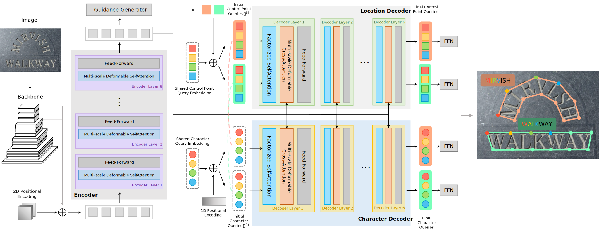

# TESTR: Text Spotting Transformers

This repository is the official implementations for the following paper:

[Text Spotting Transformers](https://arxiv.org/abs/2204.01918)

[Xiang Zhang](https://xzhang.dev), Yongwen Su, [Subarna Tripathi](https://subarnatripathi.github.io), and [Zhuowen Tu](https://pages.ucsd.edu/~ztu/), CVPR 2022



## Getting Started
We use thw following environment in our experiments. It's recommended to install the dependencies via Anaconda

+ CUDA 11.3
+ Python 3.8
+ PyTorch 1.10.1
+ Official Pre-Built Detectron2

#### Installation

Please refer to the **Installation** section of AdelaiDet: [README.md](https://github.com/aim-uofa/AdelaiDet/blob/master/README.md). 

If you have not installed Detectron2, following the official guide: [INSTALL.md](https://github.com/facebookresearch/detectron2/blob/main/INSTALL.md). 

After that, build this repository with

```bash
python setup.py build develop
```

#### Preparing Datasets

Please download TotalText, CTW1500, MLT, and CurvedSynText150k according to the guide provided by AdelaiDet: [README.md](https://github.com/aim-uofa/AdelaiDet/blob/master/datasets/README.md).

ICDAR2015 dataset can be download via [link](https://ucsdcloud-my.sharepoint.com/:u:/g/personal/xiz102_ucsd_edu/EWgEM5BSRjBEua4B_qLrGR0BaombUL8K3d23ldXOb7wUNA?e=7VzH34).

Extract all the datasets and make sure you organize them as follows

```
- datasets
  | - CTW1500
  |   | - annotations
  |   | - ctwtest_text_image
  |   | - ctwtrain_text_image
  | - totaltext (or icdar2015)
  |   | - test_images
  |   | - train_images
  |   | - test.json
  |   | - train.json
  | - mlt2017 (or syntext1, syntext2)
      | - annotations
      | - images
```

After that, download [polygonal annotations](https://ucsdcloud-my.sharepoint.com/:u:/g/personal/xiz102_ucsd_edu/ES4aqkvamlJAgiPNFJuYkX4BLo-5cDx9TD_6pnMJnVhXpw?e=tu9D8t), along with [evaluation files](https://ucsdcloud-my.sharepoint.com/:u:/g/personal/xiz102_ucsd_edu/Ea5oF7VFoe5NngUoPmLTerQBMdiVUhHcx2pPu3Q5p3hZvg?e=2NJNWh) and extract them under `datasets` folder.

#### Visualization Demo

You can try to visualize the predictions of the network using the following command:

```bash
python demo/demo.py --config-file <PATH_TO_CONFIG_FILE> --input <FOLDER_TO_INTPUT_IMAGES> --output <OUTPUT_FOLDER> --opts MODEL.WEIGHTS <PATH_TO_MODEL_FILE> MODEL.TRANSFORMER.INFERENCE_TH_TEST 0.3
```

You may want to adjust `INFERENCE_TH_TEST` to filter out predictions with lower scores.

#### Training

You can train from scratch or finetune the model by putting pretrained weights in `weights` folder.

Example commands:

```bash
python tools/train_net.py --config-file <PATH_TO_CONFIG_FILE> --num-gpus 8
```

All configuration files can be found in `configs/TESTR`, excluding those files named `Base-xxxx.yaml`.

`TESTR_R_50.yaml` is the config for TESTR-Bezier, while `TESTR_R_50_Polygon.yaml` is for TESTR-Polygon.

#### Evaluation

```bash
python tools/train_net.py --config-file <PATH_TO_CONFIG_FILE> --eval-only MODEL.WEIGHTS <PATH_TO_MODEL_FILE>
```

## Pretrained Models

<table>
<thead>
  <tr>
    <th>Dataset</th>
    <th>Annotation Type</th>
    <th>Lexicon</th>
    <th>Det-P</th>
    <th>Det-R</th>
    <th>Det-F</th>
    <th>E2E-P</th>
    <th>E2E-R</th>
    <th>E2E-F</th>
    <th>Link</th>
  </tr>
</thead>
<tbody>
  <tr>
    <td rowspan="2"><span style="font-weight:400;font-style:normal;text-decoration:none">Pretrain</span></td>
    <td>Bezier</td>
    <td>None</td>
    <td>88.87</td>
    <td>76.47</td>
    <td>82.20</td>
    <td>63.58</td>
    <td>56.92</td>
    <td>60.06</td>
    <td><a href="https://ucsdcloud-my.sharepoint.com/:u:/g/personal/xiz102_ucsd_edu/EU5VLFSLcfJFm_gFYDf4HX4BloAAlq1nshsJaPoZSJDxWw?e=WwzQFv" target="_blank" rel="noopener noreferrer">OneDrive</a></td>
  </tr>
  <tr>
    <td>Polygonal</td>
    <td>None</td>
    <td>88.18</td>
    <td>77.51</td>
    <td>82.50</td>
    <td>66.19</td>
    <td>61.14</td>
    <td>63.57</td>
    <td><a href="https://ucsdcloud-my.sharepoint.com/:u:/g/personal/xiz102_ucsd_edu/EW4ewmHyPaJFqPbf_iEoQGEBfVVtlPtoK5XjgVCuXxQWpA?e=M4RSkq" target="_blank" rel="noopener noreferrer">OneDrive</a></td>
  </tr>
  <tr>
    <td rowspan="4"><span style="font-weight:400;font-style:normal;text-decoration:none">TotalText</span></td>
    <td rowspan="2">Bezier</td>
    <td>None</td>
    <td>92.83</td>
    <td>83.65</td>
    <td>88.00</td>
    <td>74.26</td>
    <td>69.05</td>
    <td>71.56</td>
    <td rowspan="2"><a href="https://ucsdcloud-my.sharepoint.com/:u:/g/personal/xiz102_ucsd_edu/EVAgHo_OdOFPqkIFcVh7w3EByIgZD3PS3wCYXxW7Qizn7A?e=lgl6Q2" target="_blank" rel="noopener noreferrer">OneDrive</a></td>
  </tr>
  <tr>
    <td>Full</td>
    <td>-</td>
    <td>-</td>
    <td>-</td>
    <td>86.42</td>
    <td>80.35</td>
    <td>83.28</td>
  </tr>
  <tr>
    <td rowspan="2">Polygonal</td>
    <td>None</td>
    <td>93.36</td>
    <td>81.35</td>
    <td>86.94</td>
    <td>76.85</td>
    <td>69.98</td>
    <td>73.25</td>
    <td rowspan="2"><a href="https://ucsdcloud-my.sharepoint.com/:u:/g/personal/xiz102_ucsd_edu/ESwSFxppsplEiEaUphJB0TABkIKoRvIljkVIazPUNEXI7g?e=Q8zJ0Q" target="_blank" rel="noopener noreferrer">OneDrive</a></td>
  </tr>
  <tr>
    <td>Full</td>
    <td>-</td>
    <td>-</td>
    <td>-</td>
    <td>88.00</td>
    <td>80.13</td>
    <td>83.88</td>
  </tr>
  <tr>
    <td rowspan="4"><span style="font-weight:400;font-style:normal;text-decoration:none">CTW1500</span></td>
    <td rowspan="2">Bezier</td>
    <td>None</td>
    <td>89.71</td>
    <td>83.07</td>
    <td>86.27</td>
    <td>55.44</td>
    <td>51.34</td>
    <td>53.31</td>
    <td rowspan="2"><a href="https://ucsdcloud-my.sharepoint.com/:u:/g/personal/xiz102_ucsd_edu/EU17mK38HT1DvsfeylJiYloBpZyhehG2rfw_IZiPrfgPYw?e=oa3gtR" target="_blank" rel="noopener noreferrer">OneDrive</a></td>
  </tr>
  <tr>
    <td>Full</td>
    <td>-</td>
    <td>-</td>
    <td>-</td>
    <td>83.05</td>
    <td>76.90</td>
    <td>79.85</td>
  </tr>
  <tr>
    <td rowspan="2">Polygonal</td>
    <td>None</td>
    <td>92.04</td>
    <td>82.63</td>
    <td>87.08</td>
    <td>59.14</td>
    <td>53.09</td>
    <td>55.95</td>
    <td rowspan="2"><a href="https://ucsdcloud-my.sharepoint.com/:u:/g/personal/xiz102_ucsd_edu/ETkgFej-l39Gr7GYqwZt6LQBH9r2snHlidb3pTEGjiWZPw?e=9I5plv" target="_blank" rel="noopener noreferrer">OneDrive</a></td>
  </tr>
  <tr>
    <td>Full</td>
    <td>-</td>
    <td>-</td>
    <td>-</td>
    <td>86.16</td>
    <td>77.34</td>
    <td>81.51</td>
  </tr>
  <tr>
    <td rowspan="4"><span style="font-weight:400;font-style:normal;text-decoration:none">ICDAR15</span></td>
    <td rowspan="4">Polygonal</td>
    <td>None</td>
    <td>90.31</td>
    <td>89.70</td>
    <td>90.00</td>
    <td>65.49</td>
    <td>65.05</td>
    <td>65.27</td>
    <td rowspan="4"><a href="https://ucsdcloud-my.sharepoint.com/:u:/g/personal/xiz102_ucsd_edu/ETwRegsVcwtNgnbjm-79XqQBkQgjsRwIUedJysUz8Fm6wA?e=yKR2mN" target="_blank" rel="noopener noreferrer">OneDrive</a></td>
  </tr>
  <tr>
    <td>Strong</td>
    <td>-</td>
    <td>-</td>
    <td>-</td>
    <td>87.11</td>
    <td>83.29</td>
    <td>85.16</td>
  </tr>
  <tr>
    <td>Weak</td>
    <td>-</td>
    <td>-</td>
    <td>-</td>
    <td>80.36</td>
    <td>78.38</td>
    <td>79.36</td>
  </tr>
  <tr>
    <td>Generic</td>
    <td>-</td>
    <td>-</td>
    <td>-</td>
    <td>73.82</td>
    <td>73.33</td>
    <td>73.57</td>
  </tr>
</tbody>
</table>

The `Lite` models only use the image feature from the last stage of ResNet.

| Method           | Annotation Type | Lexicon | Det-P  | Det-R  | Det-F  | E2E-P  | E2E-R  | E2E-F  | Link                                                         |
| ---------------- | --------------- | ------- | ------ | ------ | ------ | ------ | ------ | ------ | ------------------------------------------------------------ |
| Pretrain (Lite)  | Polygonal       | None    | 90.28 | 72.58 | 80.47 | 59.49 | 50.22 | 54.46 | [OneDrive](https://ucsdcloud-my.sharepoint.com/:u:/g/personal/xiz102_ucsd_edu/EcG-WKHN7dlNnzUJ5g301goBNknB-_IyADfVoW9q8efIIA?e=8dHW3K) |
| TotalText (Lite) | Polygonal       | None    | 92.16 | 79.09 | 85.12 | 66.42 | 59.06 | 62.52 | [OneDrive](https://ucsdcloud-my.sharepoint.com/:u:/g/personal/xiz102_ucsd_edu/ETL5VCes0eJBuktGqHqGu_wBltwbngIhqmqePIWfaWgGxw?e=hDkana) |

## Citation
```
@misc{zhang2022text,
      title={Text Spotting Transformers}, 
      author={Xiang Zhang and Yongwen Su and Subarna Tripathi and Zhuowen Tu},
      year={2022},
      eprint={2204.01918},
      archivePrefix={arXiv},
      primaryClass={cs.CV}
}
```

## License
This repository is released under the Apache License 2.0. License can be found in [LICENSE](LICENSE) file.


## Acknowledgement

Thanks to [AdelaiDet](https://github.com/aim-uofa/AdelaiDet) for a standardized training and inference framework, and [Deformable-DETR](https://github.com/fundamentalvision/Deformable-DETR) for the implementation of multi-scale deformable cross-attention.
